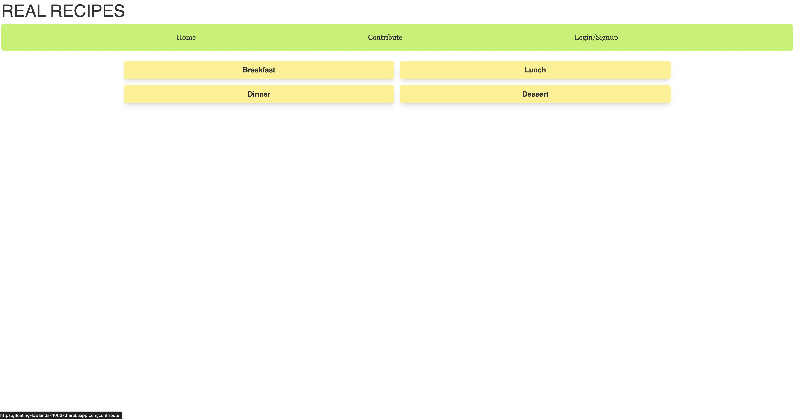

<h1 align="center">Real Recipes</h1>

## Table of Contents
1. [Project Description](#project-description)
2. [Installation Instructions](#installation-Instructions)
3. [How to Use](#how-to-use)
4. [How to contribute](#how-to-contribute)
5. [Testing](#testing)
6. [Contact](#contact)

## Project Description
* A user friendly website where you are able to login and logout. The user can contribute by adding their own recipe, they can browse recipes and review them.

## Installation Instructions
* This application can be accessed via web browser https://floating-lowlands-40637.herokuapp.com/

## How to Use
* You can log in and out, once you are logged in you can browse categories, contribute, and review recipes.

## How to Contribute
* You can contribute by adding you own recipes once you have created a login.

## Testing
  * No tests are currently available

Deployed Link: https://floating-lowlands-40637.herokuapp.com/

Below is a screenshot of our homepage:

Below is a demo of the website:

Pitch Deck: https://docs.google.com/presentation/d/17HqIwJMNpv0qFrrSWXVuRg2_as1vqyRQhkHNbRPccg8/edit?usp=sharing
Wireframe: https://app.diagrams.net/#Hkabdomora%2FProj2Grp2%2Fmain%2FUntitled%20Diagram.drawio
